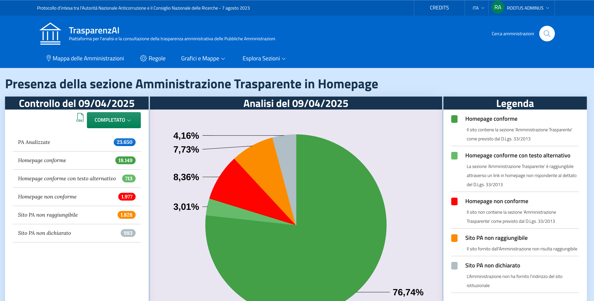

# UI - Service

[](../main/LICENSE)
[](../../pkgs/container/ui-service)
[](https://github.com/cnr-anac/ui-service/actions/workflows/build.yml)
[](https://angular.dev/)
[](https://getbootstrap.com/)

## Introduzione
UI Service è parte della suite di servizi per la verifica delle informazioni sulla Trasparenza dei siti web delle Pubbliche amministrazioni italiane.
Integra e mostra i dati presenti nei vari servizi fornendo la possibilità, avendo gli opportuni permessi, di attivare le funzionalità preposte all'inserimento e alla cancellazione degli stessi, inoltre è possibile attivare l'autenticazione su tutte le pagine, o in alternativa di accedere senza autenticazione per la sola consultazione dei dati per poi richiederla successivamente.  



# Indice

- [Dipendenze principali](#dipendenze-principali)
- [Variabili di Ambiente](#variabili-di-ambiente)
- [Autorizzazioni](#autorizzazioni)
- [Come installare](#come-installare)
- [Come contribuire](#come-contribuire)
- [Manutenzione](#manutenzione)
- [Licenza](#licenza)

## Dipendenze principali
| Nome                                                              | Versione |
|-------------------------------------------------------------------|----------|
| [Angular](https://angular.dev/)                                   | 18.1.1   |
| [Amcharts5](https://www.amcharts.com/)                            | 5.10.5   |
| [Leaflet](https://leafletjs.com/)                                 | 1.9.12   |
| [d3-org-chart](https://github.com/bumbeishvili/org-chart)         | 3.1.1    |
| [bootstrap-italia](https://italia.github.io/bootstrap-italia/)    | 2.14.0   |
| [Design Angular Kit](https://italia.github.io/design-angular-kit) | 1.3.0    |

## Variabili di Ambiente

| Nome                       | Valore di default                  | Descrizione                                                                                        |
|----------------------------|------------------------------------|----------------------------------------------------------------------------------------------------|
| BASE_HREF                  | /                                  | URL di base da usare per tutti i link relativi                                                     |
| API_URL                    | https://dica33.ba.cnr.it           | URL di riferimento dei servizi                                                                     |
| COMPANY_API_URL            | $API_URL/public-sites-service      | URL del servizio [public-sites-service](https://github.com/cnr-anac/public-sites-service)          |
| CONDUCTOR_API_URL          | $API_URL/conductor-server          | URL del servizio [conductor-service](https://github.com/cnr-anac/conductor)                        |
| RESULT_API_URL             | $API_URL/result-service            | URL del servizio [result-service](https://github.com/cnr-anac/result-service)                      |
| RESULT_AGGREGATOR_API_URL  | $API_URL/result-aggregator-service | URL del servizio [result-aggregator-service](https://github.com/cnr-anac/result-aggregator-service)|
| TASK_SCHEDULER_API_URL     | $API_URL/task-scheduler-service    | URL del servizio [task-scheduler-service](https://github.com/cnr-anac/task-scheduler-service)      |
| RULE_API_URL               | $API_URL/rule-service              | URL del servizio [rule-service](https://github.com/cnr-anac/rule-service)                          |
| CRAWLER_API_URL            | $API_URL/crawl                     | URL del servizio [crawler-service](https://github.com/cnr-anac/crawler-service)                    |
| OIDC_ENABLE                | false                              | Parametro che indica se è attiva l'autenticazione tramite protocollo basato su OAuth 2.0           |
| OIDC_FORCE                 | false                              | Parametro che indica se l'autenticazione viene forzata su tutte le pagine                          |
| OIDC_AUTHORITY             |                                    | URL del servizio authority di norma è nella forma ```.../.well-known/openid-configuration```       |
| OIDC_REDIRECTURL           | http://localhost/auth/signin       | URL necessiaria per il redirect dopo l'accesso                                                     |
| OIDC_CLIENTID              | angular-public                     | Identificativo del client da usare, va impostato sul sistema di autenticazione                     |
| OIDC_POSTLOGOUTREDIRECTURL |                                    | URL da utilizzare dopo aver effettuato il logout può essere anche vuoto                            |

## Autorizzazioni

Nella enumeration [role.enum.ts](src/app/auth/role.enum.ts) sono definiti i ruoli gestiti all'interno del servizio, il ruolo viene recuperato dal TOKEN JWT, nello specifico dai ruoli presenti all'interno dell'attributo **"realm_access"**:

```json
"realm_access": {
    "roles": [
      "ROLE_SUPERUSER",
      "default-roles-trasparenzai",
      "offline_access",
      "uma_authorization"
    ]
}
```

# Come installare

## 🐧 Installare npm su Linux
Il metodo consigliato è installare Node.js, che include anche npm.

✅ Metodo 1: Usare il gestore di pacchetti della distro
### Ubuntu/Debian
```bash
sudo apt update
sudo apt install nodejs npm
```
Verifica:

```bash
node -v
npm -v
```
### Fedora
```bash
sudo dnf install nodejs
```

### Arch Linux / Manjaro
```bash
sudo pacman -S nodejs npm
```

✅ Metodo 2: Usare Node Version Manager (nvm) – consigliato

- Installa nvm:

```bash
curl -o- https://raw.githubusercontent.com/nvm-sh/nvm/v0.39.7/install.sh | bash
```

- Chiudi e riapri il terminale, poi esegui:

```bash
nvm install --lts
nvm use --lts
```

- Verifica installazione:

```bash
node -v
npm -v
```

✅ Vantaggi: puoi gestire più versioni di Node.js!

## 🪟 Installare npm su Windows

### ✅ Metodo consigliato: Installer ufficiale di Node.js

- Vai su https://nodejs.org
- Scarica la versione LTS (Long Term Support)
- Esegui il file .msi e segui le istruzioni (assicura che sia selezionata l'opzione per installare anche npm)
- Una volta terminato, apri il terminale (cmd o PowerShell) e verifica:

```bash
node -v
npm -v
```
## Installare le dipendenze
Dopo aver installato npm si può procedere all'installazzione dei pacchetti definiti all'interno del file [package.json](package.json)

```bash
npm install
```


## Documentazione

### Link a documentazione esterna 

# Come contribuire

## Installare le dipendenze di sviluppo

## Struttura del progetto

## Community

### Code of conduct

### Responsible Disclosure

### Segnalazione bug e richieste di aiuto

# Manutenzione 

# Licenza 

## Licenza generale 

## Autori e Copyright

## Licenze software dei componenti di terze parti